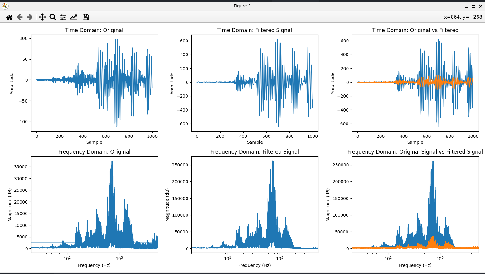

# Python Implementation
> Implementation of filter running on PS

## Instructions for Reproducing on Pynq Board
- Note: Should require no external dependencies, all Python libs installed already on board
- scp `zynqtest.ipynb` onto Zynq board, specifically into `jupyter_notebooks` directory
- Run `zynqtest.ipynb` in Jupyter web GUI

## Instructions for Reproducing Locally
- Install Python3 and pip, preferably Python 3.10
- Install `pipenv`: on Ubuntu run `pip install pipenv`
- Run `pipenv install`
- Run `pipenv shell`
- Run `python3 main.py`
- Play back `output_filtered.wav` and compare with `hal_9000.wav`

Sample output for hal_9000.wav sampling:`
